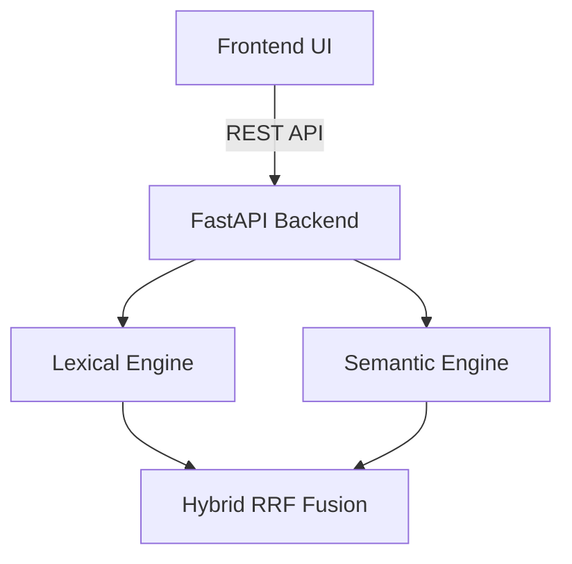

# Architecture

The system uses a decoupled architecture:
1. **Frontend**: Next.js 14, React, Tailwind CSS
2. **Backend**: FastAPI, Python, SQLite
3. **Information Retrieval**: Scikit-Learn (TF-IDF), SentenceTransformers (MiniLM), FAISS.

